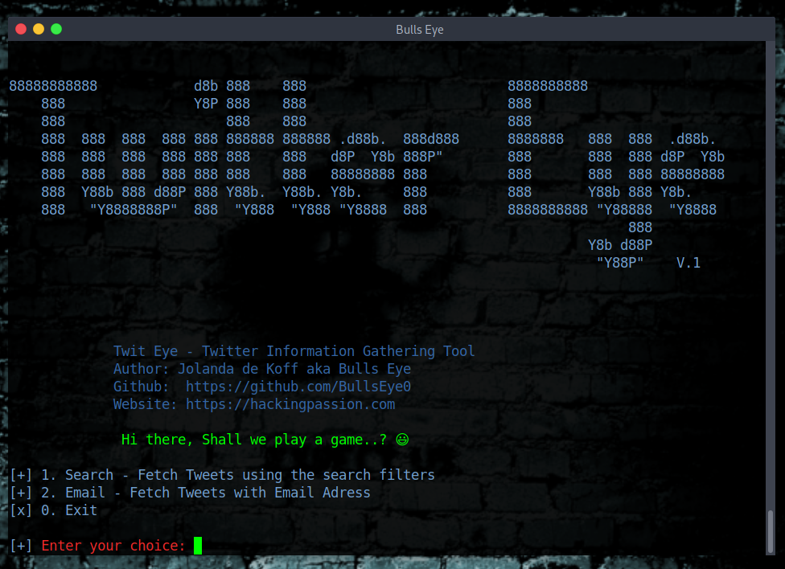

# Twitter-eye

Twitter Information Gathering Tool

## Install Twitter Eye:
* git clone https://github.com/BullsEye0/twitter-eye.git

* cd twitter-eye
  
* pip3 install -r requirements.txt

  
## Use:
* python3 twitter-eye.py

# Contact to coder
Social Networks - Connect

* Website [HackingPassion.com](https://hackingpassion.com)

* [Facebook Personal](https://www.facebook.com/profile.php?id=100069546190609)

* [linkedin](https://www.linkedin.com/in/jolandadekoff/)

* [LBRY/Odysee](https://lbry.tv/$/invite/@hackingpassion:9)

* [Facebook Page](https://www.facebook.com/ethical.hack.group)

* [Facebook Group](https://www.facebook.com/groups/ethical.hack.group/)
  
  

***

## Donate

I have developed Twitter Eye because I am passionate about this. 
Donations are one of the many ways to support what I do.

[Donate](https://hackingpassion.com/donate/)

BAT: Use [Brave](https://brave.com/bul891) and donate on any of my web pages/profiles

