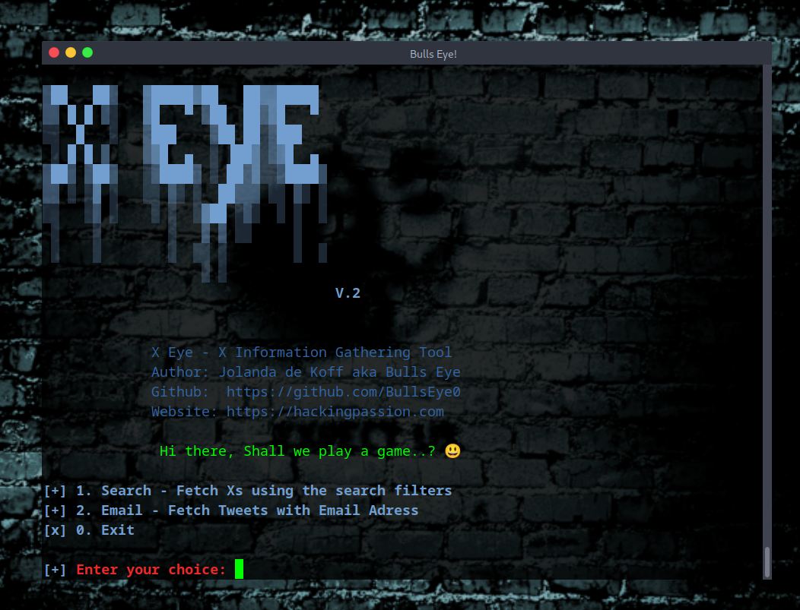

# X-eye

## X Information Gathering Tool

X Eye is an X Information Gathering Tool
With X Eye, you can search with various keywords and usernames on Twitter. Then, the data you get is saved in a .csv file. This is to make it easy to read. You can then open these files in Excel, LibreOffice or etc.
X Eye is WITHOUT an API Key that you need with most tools for X. 

"Let's make everything easy.".. 

Since I'm currently working on a project and I've created this script for it, I thought it would be a good idea to make it public for everyone to benefit from.

Hi there, Shall we play a game..? 😃

Have some fun..!

---



---

## Install X Eye:

To get started with X Eye, you obviously have `python3` and `pip3` installed.

If you haven't installed this yet, enter the following commands:


``sudo apt install python3``


``sudo install python3-pip``

---

# Setting Up Your Environment
Use a virtual environment (optional but recommended): For Python-based tools, it’s good practice to use a virtual environment so you don’t clutter your system Python. Create one with:

```python3 -m venv osint-env```

```source osint-env/bin/activate```

This creates and activates a virtual environment named osint-env. You’ll see your prompt change (often prefixed with (osint-env)), indicating the venv is active. (If you later want to exit the virtual environment, just run `deactivate`.)

## Install the GitHub Repository X Eye:


``git clone https://github.com/BullsEye0/twitter-eye.git``

``cd twitter-eye``
  
``pip3 install -r requirements.txt``

  
## Use:

``python3 twitter-eye.py``

## Video:

Here's the video I made of X Eye

Link: 

★ https://odysee.com/@hackingpassion:9/twitter-eye:7 

Invite LBRY:

★ https://lbry.tv/$/invite/@hackingpassion:9

Feel welcome to join 😃

---


# Contact to coder
Social Networks - Connect

* Website [HackingPassion.com](https://hackingpassion.com)

* [Facebook Personal](https://www.facebook.com/profile.php?id=100069546190609)

* [linkedin](https://www.linkedin.com/in/jolandadekoff/)

* [LBRY/Odysee](https://lbry.tv/$/invite/@hackingpassion:9)

* [Facebook Page](https://www.facebook.com/ethical.hack.group)

* [Facebook Group](https://www.facebook.com/groups/ethical.hack.group/)
  
  

***

## Donate


I have developed Twitter Eye because I am passionate about this. 
Donations are one of the many ways to support what I do.

[Donate](https://hackingpassion.com/donate/)

BAT: Use [Brave](https://brave.com/bul891) and donate on any of my web pages/profiles

[](https://www.paypal.com/cgi-bin/webscr?cmd=_s-xclick&hosted_button_id=R96YN2PUS8V8W)
